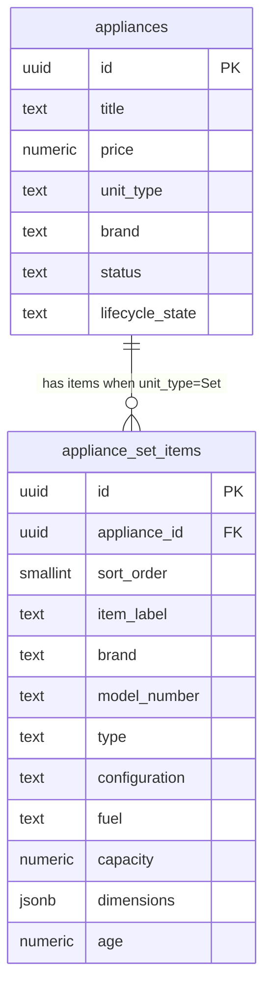

# Inventory Set Support Plan

## Core Approach: Parent-Child Model

The `appliances` row remains the **set listing** — price, title, status, lifecycle, images, color, description. A new `appliance_set_items` child table stores each individual machine's unique specs.



**What stays on the parent `appliances` row for a set:**
- `title`, `price`, `condition`, `status`, `lifecycle_state`
- `color`, `features`, `description_long`
- All images (via `appliance_images`)
- `unit_type = 'Set'`
- `brand` / `model_number` on the parent become secondary (display fallback only)

**What moves to `appliance_set_items` (per machine):**
- `item_label` (e.g. "Washer", "Dryer")
- `brand`, `model_number`, `type`, `configuration`, `fuel`, `capacity`, `dimensions`, `age`

**Mirror to `products`:** The parent `products` row is unchanged; set items are admin-internal and not mirrored.

---

## UX Flow

**Create/Edit form — when `unit_type = 'Set'`:**

A "Set Items" section appears below the top-level fields:

```
[ Set-level fields: title, price, condition, brand, color, status, features, images ]

--- Set Items ---
[+] Add Machine

  [Machine 1]          [Machine 2]
  Label: Washer        Label: Dryer
  Brand: ___           Brand: ___
  Model #: ___         Model #: ___
  Type: ___            Type: ___
  Config: ___          Config: ___
  Fuel: ___            Fuel: ___
  Capacity: ___        Capacity: ___
  Dimensions: ___      Dimensions: ___
  Age: ___             Age: ___
  [Scan Tag]           [Scan Tag]
  [Remove]
```

- Minimum 2 items enforced client-side for sets
- Each item has its own AI tag scan (calls `/api/extract-appliance`, fills that item's fields)
- Items are serialized into `FormData` as `set_items_json` (JSON array)

**Detail view:** A "Set Components" section lists each machine card with its specs.

---

## Implementation Tasks

Each task requires human verification before the next begins.

- [x] **Task 1 — Schema:** Write and apply `20260624000000_add_appliance_set_items.sql` migration; add `ApplianceSetItem` type to `lib/types/inventory.ts`
- [x] **Task 2 — Data accessor:** Add `createSetItems`, `getSetItems`, `upsertSetItems`, `deleteSetItems` in `lib/data/appliance-set-items.ts`
- [x] **Task 3 — Dual-write:** Update `lib/inventory/appliance-dual-write.ts` — `createApplianceDualWrite` and `updateApplianceDualWrite` to call set-item CRUD; rollback covers set items
- [x] **Task 4 — Form types:** Extend `app/dashboard/inventory/new/types.ts` with `SetItemDraft[]`; update `actions.ts` to pass `set_items_json` through
- [x] **Task 5 — Create form UI:** Add dynamic `SetItemsSection` to `app/dashboard/inventory/new/inventory-form.tsx`
- [x] **Task 6 — Edit form UI:** Mirror `SetItemsSection` into `app/dashboard/inventory/edit/edit-form.tsx`
- [x] **Task 7 — Detail view:** Add "Set Components" to `app/dashboard/inventory/[id]/page.tsx`; update `getApplianceById` to join `appliance_set_items`

---

## Key Constraints

- The `products` mirror row is unaffected — backward-compatible with `asu-frontend`
- `ON DELETE CASCADE` on `appliance_set_items.appliance_id` means the existing delete path requires no changes
- Set items are serialized to `FormData` as a single JSON field (`set_items_json`)
- RLS enabled on `appliance_set_items` (authenticated + service_role full access; admin-internal)
